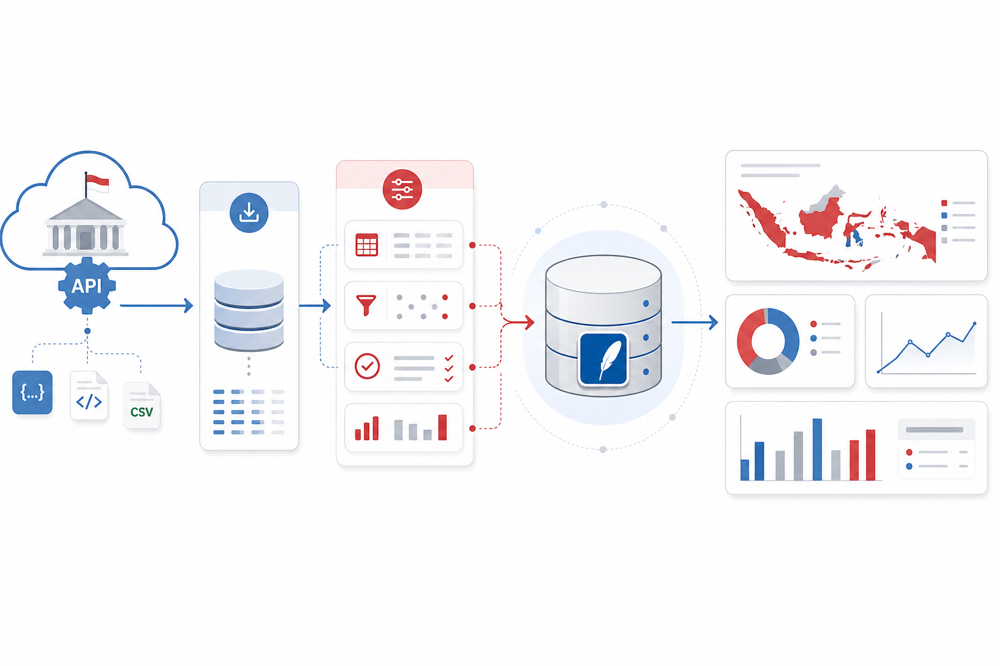
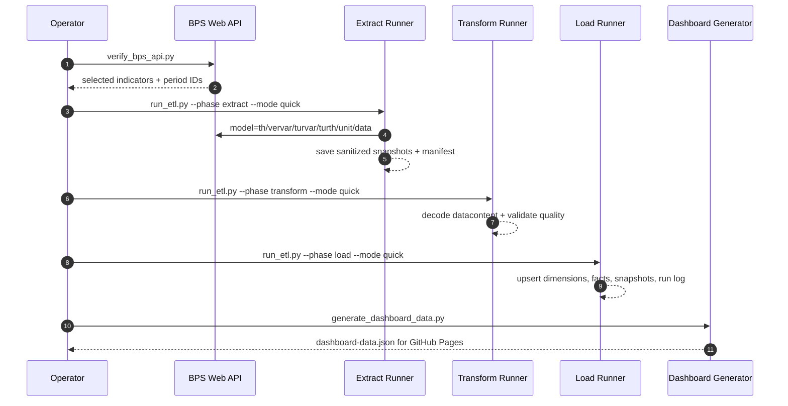
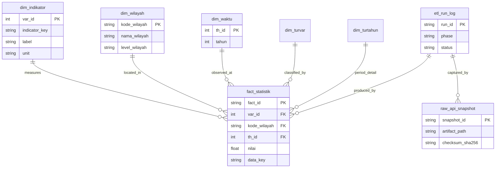
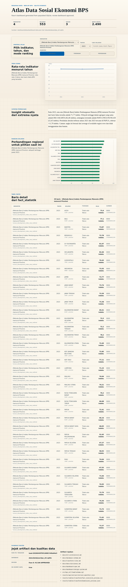
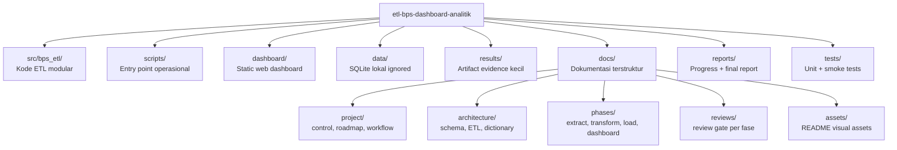

<p align="center">
  
</p>

<h1 align="center">ETL BPS Dashboard Analitik</h1>

<p align="center">
  <strong>ETL Pipeline dan Dashboard Analitik Data Sosial Ekonomi Berbasis Web API Badan Pusat Statistik (BPS)</strong>
</p>

<p align="center">
  <a href="https://feb027.github.io/etl-bps-dashboard-analitik/dashboard/"></a>
  
  
  
</p>

<p align="center">
  <a href="https://feb027.github.io/etl-bps-dashboard-analitik/dashboard/">Dashboard</a> ·
  <a href="docs/README.md">Dokumentasi</a> ·
  <a href="reports/progress-6-1-data-expansion.md">Progress Fase 6.1</a> ·
  <a href="docs/reviews/REVIEW_phase6_1_data_expansion.md">Review</a>
</p>

---

## Ringkasan

Repo ini membangun pipeline **Extract → Transform → Load (ETL)** dari **BPS Web API**, menyimpan data sosial-ekonomi ke **SQLite**, lalu menerbitkan dashboard analitik statis melalui **GitHub Pages**. Semua grafik, tabel, dan metrik berasal dari artifact nyata; tidak ada dummy chart atau data contoh yang dipresentasikan sebagai data asli.

| Area | Status |
|---|---:|
| Fase saat ini | **6.1 — Data Expansion** |
| Indikator sosial-ekonomi | **6** |
| Tahun data | **2021–2024** |
| Wilayah/kategori BPS | **579** |
| Fact rows | **4.292** |
| Raw snapshot audit | **54** |
| Transform quality gate | **passed** |
| Test suite | **41 passed** |
| Dashboard live | [GitHub Pages](https://feb027.github.io/etl-bps-dashboard-analitik/dashboard/) |

## Daftar Isi

- [Fitur Utama](#fitur-utama)
- [Arsitektur Sistem](#arsitektur-sistem)
- [Alur ETL](#alur-etl)
- [Model Data](#model-data)
- [Dashboard](#dashboard)
- [Struktur Repository](#struktur-repository)
- [Quickstart](#quickstart)
- [Validasi](#validasi)
- [Dokumentasi](#dokumentasi)
- [Aturan Data](#aturan-data)

## Fitur Utama

- **BPS API proof-first** — pipeline memakai `th_id` dari endpoint `model=th`, bukan asumsi string tahun mentah.
- **Metadata-aware decoding** — `datacontent` BPS didekode dari metadata `vervar`, `var`, `turvar`, `tahun`, dan `turtahun`.
- **Star-schema SQLite** — tabel dimensi, fact table, raw snapshot audit, dan ETL run log.
- **Quality gate eksplisit** — unmatched key, duplicate grain, dan null/non-numeric value harus nol.
- **Dashboard static-first** — dashboard dapat diakses di GitHub Pages tanpa backend runtime.
- **Evidence-first documentation** — setiap fase punya progress report dan review gate.

## Arsitektur Sistem

```mermaid
flowchart LR
    BPS["BPS Web API\nwebapi.bps.go.id"] --> Extract["Extract Layer\nmetadata + dynamic snapshots"]
    Extract --> Raw["Raw Evidence\nJSON snapshots + manifest"]
    Raw --> Transform["Transform Layer\ndatacontent decoder + quality gate"]
    Transform --> Tables["Validated Tables\nfact + dimensions preview"]
    Tables --> Load["Load Layer\nSQLite star schema"]
    Load --> DB[("SQLite Warehouse\ndata/database/bps_etl.sqlite")]
    DB --> Generator["Dashboard Data Generator\nSQLite → dashboard JSON"]
    Generator --> JSON["dashboard/data/dashboard-data.json"]
    JSON --> UI["Static Dashboard\nHTML + CSS + JS + ECharts"]
    UI --> Pages["GitHub Pages"]

    classDef api fill:#eff6ff,stroke:#2563eb,color:#1e3a8a;
    classDef etl fill:#f0fdf4,stroke:#16a34a,color:#14532d;
    classDef data fill:#fff7ed,stroke:#ea580c,color:#7c2d12;
    classDef ui fill:#fdf2f8,stroke:#db2777,color:#831843;
    class BPS api;
    class Extract,Transform,Load,Generator etl;
    class Raw,Tables,DB,JSON data;
    class UI,Pages ui;
```



## Alur ETL



### Indikator yang Dipakai

| Kode | Indikator | Tema | Tahun |
|---|---|---|---|
| `poverty_rate` | Persentase Penduduk Miskin | Kemiskinan | 2021–2024 |
| `open_unemployment_rate` | Tingkat Pengangguran Terbuka | Ketenagakerjaan | 2021–2024 |
| `mean_years_schooling_new_method` | Rata-rata Lama Sekolah | Pendidikan | 2021–2024 |
| `human_development_index_new_method` | Indeks Pembangunan Manusia | Pembangunan Manusia | 2021–2024 |
| `gini_ratio` | Gini Ratio | Ketimpangan | 2021–2024 |
| `regional_gdp_growth_constant_2010` | Pertumbuhan PDRB ADHK 2010 | Ekonomi Regional | 2021–2024 |

## Model Data



**Fact grain:** `var_id + kode_wilayah + th_id + turvar_id + turth_id + source_domain`.

## Dashboard

Dashboard live: **https://feb027.github.io/etl-bps-dashboard-analitik/dashboard/**

Komponen utama:

- KPI ringkas: indikator, wilayah, tahun, dan jumlah row.
- Tren per indikator dan tahun.
- Ranking wilayah dengan mode tertinggi, terendah, dan perubahan terbesar.
- Tabel detail hasil filter.
- Panel evidence: quality gate, review file, artifact path, dan ETL run id.

<details>
<summary><strong>Screenshot evidence</strong></summary>



</details>

## Struktur Repository



## Quickstart

### 1. Setup environment

```bash
python3 -m venv .venv
source .venv/bin/activate
pip install -r requirements.txt
cp .env.example .env
# isi BPS_API_KEY di .env
```

### 2. Jalankan pipeline lengkap

```bash
python3 scripts/verify_bps_api.py
python3 scripts/run_etl.py --phase extract --mode quick
python3 scripts/run_etl.py --phase transform --mode quick
python3 scripts/run_etl.py --phase load --mode quick
python3 scripts/generate_dashboard_data.py
```

### 3. Preview dashboard lokal

```bash
python3 -m http.server 8000
# buka http://localhost:8000/dashboard/
```

## Validasi

```bash
python3 -m py_compile scripts/*.py
python3 -m pytest -q
python3 -m json.tool dashboard/data/dashboard-data.json >/dev/null
python3 -m json.tool results/api/bps_api_probe_summary.json >/dev/null
python3 -m json.tool results/api/extract/extract_manifest.json >/dev/null
python3 -m json.tool results/tables/transform/transform_quality_metrics.json >/dev/null
python3 -m json.tool results/database/load_metrics.json >/dev/null
for f in dashboard/scripts/*.js; do node --check "$f"; done
git diff --check
```

Expected latest baseline:

```text
41 passed
quality_gate = passed
fact_statistik = 4292 rows
```

## Dokumentasi

| Kategori | Link |
|---|---|
| Index dokumentasi | [`docs/README.md`](docs/README.md) |
| Project control | [`docs/project/project-control.md`](docs/project/project-control.md) |
| Roadmap | [`docs/project/roadmap.md`](docs/project/roadmap.md) |
| ETL architecture | [`docs/architecture/etl-architecture.md`](docs/architecture/etl-architecture.md) |
| Database schema | [`docs/architecture/database-schema.md`](docs/architecture/database-schema.md) |
| Data dictionary | [`docs/architecture/data-dictionary.md`](docs/architecture/data-dictionary.md) |
| Dashboard spec | [`docs/phases/dashboard-spec.md`](docs/phases/dashboard-spec.md) |
| Latest review | [`docs/reviews/REVIEW_phase6_1_data_expansion.md`](docs/reviews/REVIEW_phase6_1_data_expansion.md) |
| Final report draft | [`reports/final-report.md`](reports/final-report.md) |

## Aturan Data

- `.env`, database lokal, cache, dan file besar tidak boleh di-commit.
- API key hanya boleh dibaca dari `.env`.
- Dashboard tidak boleh menampilkan dummy chart/table sebagai data asli.
- Semua angka di README/laporan harus berasal dari `results/`, SQLite, atau `dashboard/data/dashboard-data.json`.
- Jika artifact belum tersedia, dokumentasi harus menyatakan belum tersedia; tidak boleh mengarang hasil.

## Referensi Teknis

- GitHub Mermaid documentation: https://docs.github.com/en/get-started/writing-on-github/working-with-advanced-formatting/creating-diagrams
- BPS Web API: https://webapi.bps.go.id/

---

<p align="center">
  <strong>Evidence-first. Real data only. No dummy dashboard.</strong>
</p>
