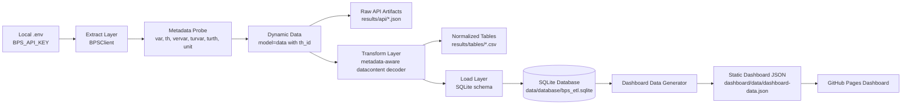

# ETL Architecture — Fase 2

Status: **design approved candidate**. Implementasi bertahap dimulai pada Fase 3–5.

## Prinsip Arsitektur

1. **Evidence-first** — semua data dashboard harus berasal dari artifact API, database, atau hasil ETL nyata.
2. **No fake dashboard** — dashboard tidak boleh menampilkan dummy chart sebagai data asli.
3. **BPS correctness first** — gunakan `model=th` untuk mendapatkan `th_id` sebelum mengambil `model=data`.
4. **Metadata-aware transform** — decode `datacontent` dengan metadata lookup, bukan fixed slicing.
5. **Idempotent load** — rerun ETL tidak boleh menggandakan fact rows.
6. **Audit trail** — raw response summary, normalized rows, dan run log harus bisa dilacak.

## Diagram Alur

## Layer Responsibilities

### 1. Extract Layer

Tanggung jawab:

- membaca API key dari `.env` atau environment,
- memanggil BPS endpoint `https://webapi.bps.go.id/v1/api/list`,
- mengambil metadata `var`, `th`, `vervar`, `turvar`, `turth`, dan `unit`,
- mengambil `model=data` dengan `th_id` valid,
- menyimpan response kecil/auditable ke `results/api/`.

Tidak boleh:

- hardcode API key,
- menyimpan full request URL yang mengandung key,
- menganggap tahun literal sama dengan `th_id`.

### 2. Transform Layer

Tanggung jawab:

- membersihkan label HTML ringan dari metadata BPS,
- membangun index composite key dari metadata,
- decode `datacontent` menjadi baris tabular,
- menghasilkan dimension rows dan fact rows,
- menolak response ambigu jika composite key collision terjadi,
- menghasilkan data quality metrics.

### 3. Load Layer

Tanggung jawab:

- membuat SQLite schema dari `src/bps_etl/load/schema.sql`,
- melakukan upsert dimension tables,
- melakukan upsert `fact_statistik`,
- mencatat `etl_run_log`,
- memastikan foreign key aktif,
- fail loudly jika fact rows = 0 saat mode production/full run.

### 4. Dashboard Data Generator

Tanggung jawab:

- membaca SQLite database hasil ETL,
- menghitung KPI, trend, dan breakdown wilayah,
- menulis `dashboard/data/dashboard-data.json`,
- menampilkan empty state jika database/fact rows belum tersedia.

## Artifact Flow

| Tahap | Input | Output |
|---|---|---|
| Extract metadata | BPS API key, target indicators | `results/api/metadata_*.json` |
| Extract data | `var_id`, `th_id` | `results/api/dynamic_*_*.json` |
| Transform | Raw dynamic response | normalized records |
| Load | normalized records | `data/database/bps_etl.sqlite` |
| Generate dashboard | SQLite fact/dim tables | `dashboard/data/dashboard-data.json` |

## Failure Policy

| Kondisi | Perilaku yang Benar |
|---|---|
| API key tidak ada | Stop dengan pesan konfigurasi `.env`. |
| `model=th` tidak menemukan tahun target | Stop untuk indikator tersebut dan catat di report. |
| `model=data` `list-not-available` | Jangan load baris kosong sebagai sukses. |
| `datacontent` kosong | Tandai sebagai no-data; jangan tampilkan chart palsu. |
| Composite key collision | Raise error; schema/load tidak boleh menerima mapping ambigu. |
| Fact rows = 0 pada full run | Mark ETL failed. |

## Batas Fase 2

Fase 2 hanya menetapkan desain architecture dan schema. Implementasi koneksi extract lebih lengkap dikerjakan pada Fase 3, transform production pada Fase 4, dan load database pada Fase 5.
